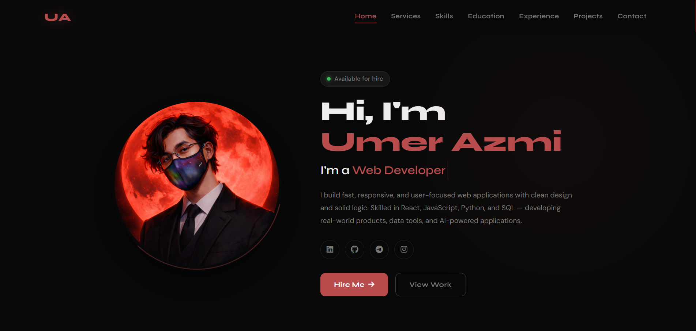
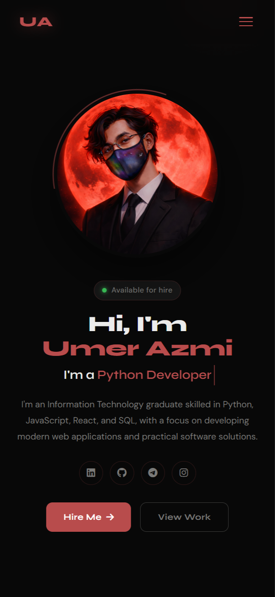

# Umer Azmi — Developer Portfolio

Modern, fully responsive portfolio built with HTML, CSS, and JavaScript. Content dynamically rendered from JSON with a dark theme and smooth animations.

🔗 **Live:** [umerazmi.github.io](https://umerazmi.github.io/)

---

## 🖥 Preview

### Desktop

### Mobile

---

## ✨ Features

* Responsive layout with glass-style nav and mobile hamburger menu
* CSS typing animation, profile image ring, scroll reveal effects
* Skills, projects, education and experience all rendered from `data.json`
* Project filter (All / Live / In Dev / Concept / Completed) with video hover
* Working contact form via Formspree
* SEO ready — meta tags, sitemap.xml, robots.txt

---

## 🛠 Tech Stack

HTML5 · CSS3 · Vanilla JS · Fetch API · Intersection Observer · Google Fonts · Font Awesome · Formspree

---

## 🚀 Run Locally

Clone the repo and open `index.html` in a browser, or use **Live Server** in VS Code.

---

Built by **Umer Azmi** · © 2026
